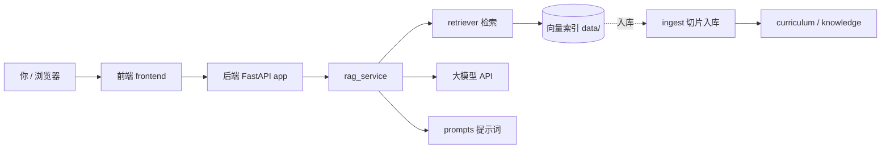

# 总览：AI-Brain 怎么串起来

用一张图先建立全局印象，再点左侧其它章节看细节。

## 调用总览

## 白话说明

1. **前端**：负责页面、主题、把你的话发给后端，并把流式回答显示出来。  
2. **后端**：会话落库、检索知识、拼提示词、调用大模型。  
3. **提示词**：在 `prompts/` 里改文字即可，不必改 Python 长字符串。  
4. **知识**：课程与笔记先「入库」变成可检索片段，对话时再捞出来。

## 对应代码（先认门牌）

| 角色 | 路径 |
|------|------|
| 前端入口 | `frontend/src/App.tsx` |
| 后端入口 | `app/main.py` |
| 对话编排 | `app/services/rag_service.py` |
| 检索 | `app/services/retriever.py` |
| 提示词 | `prompts/rag_system.txt`、`prompts/rag_user.txt` |
| 入库脚本 | `scripts/ingest.py` |

下一章看：**一次对话时，请求具体怎么走。**
