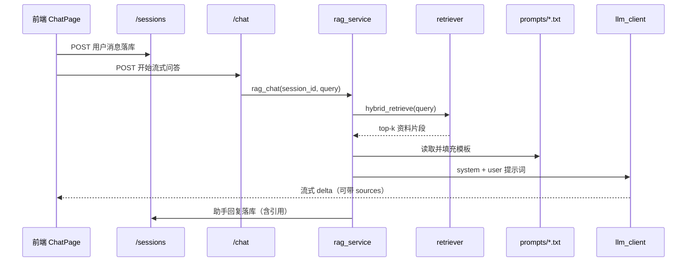

# 一次对话：RAG 调用链

你在对话页点发送之后，真正发生的事如下（当前**不会**把历史多轮发给模型，只发「本句 + 检索资料」）。

## 路线图

## 分步讲解

1. **落库用户话**  
   前端先把你的输入存进 SQLite，侧栏会话才有记录可回看。

2. **检索**  
   `retriever` 用向量 + 关键词混合，从已入库的 chunk 里找相关段落。

3. **拼提示词**  
   把资料放进 `{context}`，问题放进 `{query}`，规则来自 `prompts/rag_user.txt`。

4. **流式生成**  
   模型边生成边推给前端；引用列表往往在首包带上，消息下可点「引用来源」。

5. **落库助手话**  
   整段答完写入数据库，刷新后还在。

## 对应代码

| 步骤 | 文件 |
|------|------|
| 发消息 / 流式 | `frontend/src/pages/ChatPage.tsx`、`hooks/useChat.ts` |
| 会话 API | `app/routers/sessions.py`、`session_store.py` |
| Chat API | `app/routers/chat.py` |
| 编排 | `app/services/rag_service.py` |
| 检索 | `app/services/retriever.py` |
| 模型 | `app/services/llm_client.py` |

## 和「上下文」的关系

会话历史**有存**、**能展示**，但 `rag_chat` 调模型时目前只带本轮。若要「接着上面说」，需要以后把 `get_history` 拼进 `messages`。
