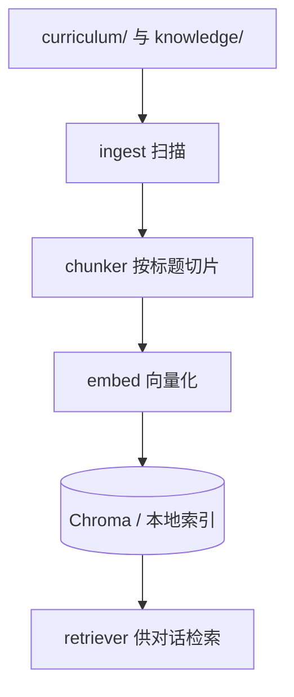

# 知识入库：文档如何变成可检索资料

对话检索的不是整份 markdown 文件，而是切好、算好向量的**片段（chunk）**。

## 路线图



## 白话说明

1. **知识源**：正式课在 `curriculum/`，笔记在 `knowledge/`。  
2. **切片**：按 markdown 标题等规则切成带 `heading_path` 的小段，方便引用「第 X 节」。  
3. **向量化**：每段变成向量，语义相近的问题更容易命中。  
4. **写入索引**：存在 `data/` 相关目录；之后 `retriever` 只读索引，不再每次读全盘课文。

## 你怎么触发入库

```powershell
Set-Location "D:\develop\AI-Brain"
python ".\scripts\ingest.py"
python ".\scripts\ingest.py" --reset
```

后端若开启 `AUTO_INGEST_ON_STARTUP`，启动时也可能因指纹变化自动入库；**大改文档后仍建议手动 `--reset`**。

## 对应代码

| 步骤 | 文件 |
|------|------|
| 命令行入口 | `scripts/ingest.py` |
| 入库业务 | `app/services/ingest_service.py` |
| 切片 | `app/services/chunker.py` |
| 向量 | `app/services/embed_service.py` |
| HTTP 触发 | `app/routers/ingest.py` |

改「切得对不对」优先看 `chunker`；改「搜得准不准」还要看 `retriever` 与是否重新入库。
