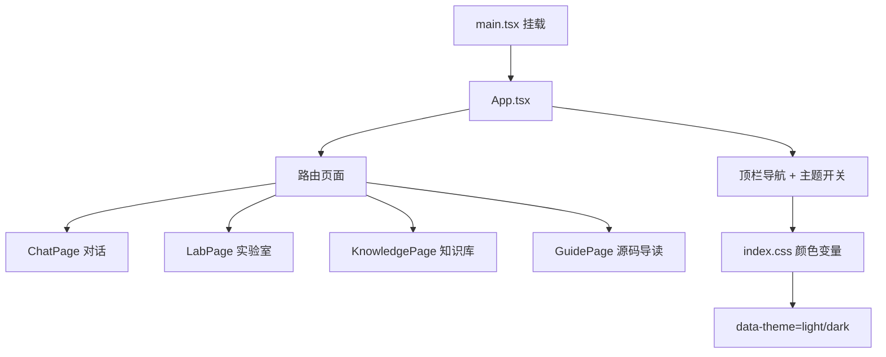

# 前端与主题

浏览器里你看到的一切，都从 `frontend/` 出去。这一章按「谁管路由 → 谁管颜色 → 对话页怎么铺」来看。

## 路线图

## 白话说明

1. **`App.tsx`**  
   顶栏链接、浅色/暗色按钮、`localStorage` 记住主题，并设置 `document.documentElement.dataset.theme`。

2. **`index.css`**  
   所有页面共用的颜色：`--bg`、`--sidebar-bg`、`--accent` 等。浅色默认白底天蓝强调；暗色是深蓝夜空。改皮肤优先改变量，少写死颜色。

3. **对话页布局**  
   - `chat-scroll`：主区域**全宽滚动**（滚动条在最右侧）  
   - 中间内容列 `max-width: 880px` 居中  
   - 输入框固定在底部，不跟着消息滚走  

4. **流式回答**  
   `useChat` / `streamChat` 连后端 `/chat`，边收字边更新 `MessageList`；引用芯片可点进知识库。

5. **示例问题 ≠ 模型提示词**  
   欢迎页那几个按钮文案在 `ChatPage.tsx` 的 `examplePrompts`；真正管模型的是 `prompts/`。

## 对应代码

| 关心什么 | 文件 |
|----------|------|
| 路由 / 主题 | `frontend/src/App.tsx` |
| 设计 token | `frontend/src/index.css` |
| 对话页 | `frontend/src/pages/ChatPage.tsx`、`ChatPage.css` |
| 消息 / 输入 | `components/chat/*` |
| API 封装 | `frontend/src/api/client.ts` |
| 流式 | `frontend/src/hooks/useChat.ts` |
| 会话列表 | `frontend/src/hooks/useSession.ts` |

本地：`frontend` 目录下 `npm run dev` → http://localhost:5173
