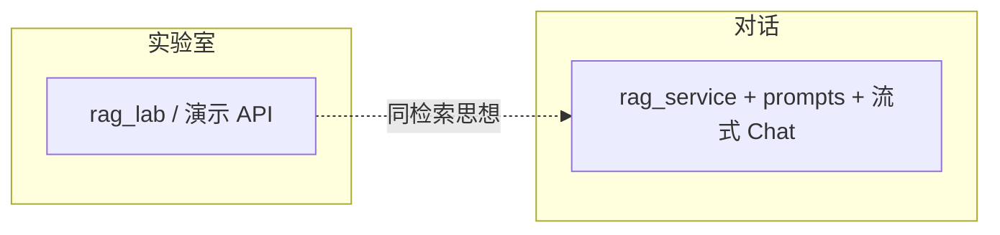

# 概念实验室

实验室把抽象概念拆成可点的 Demo，和正式「对话 RAG」是两条线：这里偏**看原理**，对话偏**真用知识库答题**。

## 路线图

```mermaid
flowchart TB
  Lab[LabPage 五个 Tab] --> T[Tokenize]
  Lab --> A[Attention]
  Lab --> E[Embedding]
  Lab --> R[RAG Demo]
  Lab --> Arch[Architecture]
  T --> API1[/tokenize]
  A --> API2[/attention]
  E --> API3[/embed]
  R --> API4[/rag 实验室接口]
  Arch --> Guide[/guide 源码导读]
```

## 各 Tab 学什么

| Tab | 你看到什么 | 主要代码 |
|-----|------------|----------|
| Tokenize | 文本切成 token 芯片 | `TokenizeDemo.tsx` |
| Attention | 注意力热力图 | `AttentionDemo.tsx` |
| Embedding | 词向量 PCA 成 3D 散点 | `EmbeddingDemo.tsx` + `utils/pca.ts` |
| RAG | 切片 + 检索过程演示 | `RagDemo.tsx` + `rag_lab_service.py` |
| Architecture | 整站总览图，跳转完整导读 | `LabPage.tsx` |

## Embedding 小提示

散点用**实心圆 + 正常混合**，避免暗色「一坨光」、浅色看不见。标签带底色小牌，跟主题色走。

## 和正式对话的区别



实验室 RAG Tab 帮你看「检索长什么样」；真正答题、引用、提示词策略走对话页那条链（见「一次对话」章）。

## 对应代码

| 层级 | 路径 |
|------|------|
| 页面 | `frontend/src/pages/LabPage.tsx` |
| 组件 | `frontend/src/components/lab/` |
| 后端演示 | `app/routers/rag.py`、`tokenize.py`、`embed.py`、`attention.py` |
| 实验室 RAG 服务 | `app/services/rag_lab_service.py` |
