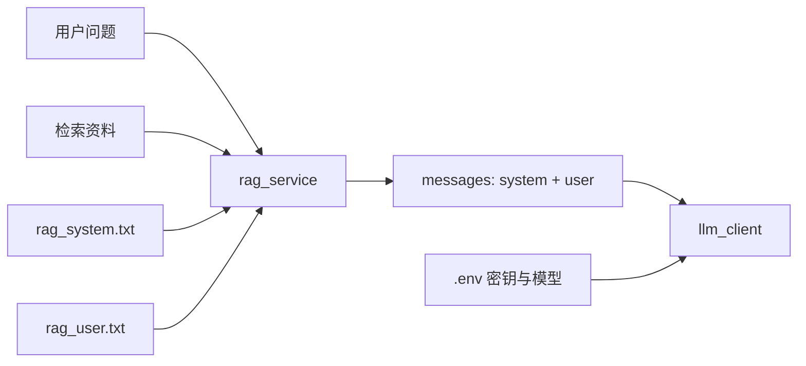

# 提示词与配置

模型「怎么答」主要由提示词决定；「连哪家模型、密钥」由环境变量决定。两者分开，改文案不必改部署配置。

## 路线图

## 提示词文件

| 文件 | 角色 |
|------|------|
| `prompts/rag_system.txt` | `role: system` 短人设 |
| `prompts/rag_user.txt` | 用户模板：资料 + 规则 + 问题 |

**必须保留的占位符**（删了会报错或接不上资料）：

- `{context}` — 检索片段  
- `{query}` — 当前用户问题  

## 何时生效

`rag_service._load_prompt` 按文件**修改时间**缓存：保存 `.txt` 后，**下一次对话**用新内容，一般不用重启后端。

## 当前答题策略（摘要）

- 优先用知识库，并引用  
- 不够时可用通用知识补充  
- 补充须标注：`【补充说明】（非知识库原文）`  

改松紧、口吻、引用格式：优先只改 `prompts/`。

## 环境配置

根目录 `.env`（从 `.env.example` 复制），常见项：

| 变量 | 含义 |
|------|------|
| `LLM_PROVIDER` | 如 `volcano` |
| `ARK_API_KEY` / `ARK_BASE_URL` / `ARK_MODEL` | 火山方舟 |
| `EMBEDDING_MODEL_NAME` | 本地向量模型 |
| `AUTO_INGEST_ON_STARTUP` | 启动是否自动入库 |
| `CORS_ORIGINS` | 允许的前端来源 |

读配置：`app/config.py`；调模型：`app/services/llm_client.py`。

## 对应代码

| 步骤 | 文件 |
|------|------|
| 读提示词 / 拼 messages | `app/services/rag_service.py` |
| 提示词正文 | `prompts/*.txt` |
| 配置 | `app/config.py`、`.env` |
| HTTP Chat | `app/routers/chat.py` |
